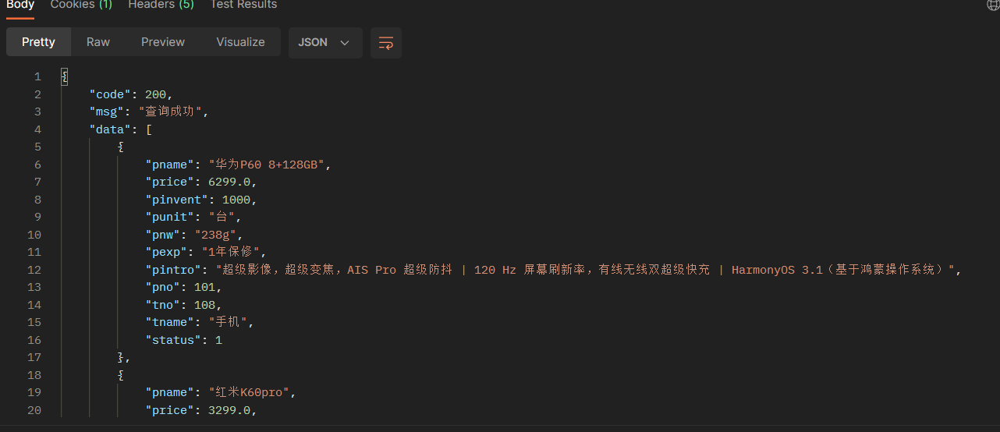

# MpBuybb
微信小程序

前端：微信小程序+后台

后端：SpringBoot框架+Mybatis-Plus框架+MySQL数据库

数据库：MySQL

# 注: 驼峰命名法每个单词首字母大写，下划线命名法每个单词之间用下划线连接，如果命名出问题了会出现奇奇怪怪的bug

## 2. 项目接口

### 2.1. 用户数据库(usr_info)
### 登陆相关接口

| 名称        | 接口                                               | 返回内容   | 描述                                       |
|-----------|--------------------------------------------------|--------|------------------------------------------|
| 登录        | post:localhost:8080/login?id=111&password=123456 | json格式 | 用户登录（~~可选MD5校验~~）id是用户名，password是登录密码    |
| 获取登录id的信息 | post:localhost:8080/getById/{id}                 | json格式 | 获取登陆者id的所有信息（获取其他人的也可以，这里没设置拦截器，校验等安全设置） |

### 2.1.1.登录返回格式

    {
    "code": 200,
    "msg": "成功",
    "data": {
    "name": "啊啊啊",
    "password": "123456",
    "position": "普通员工",
    "id": 111
    },
    "flag": true
    }

### 2.1.2.查询id返回格式

    {
    "code": 200,
    "msg": "获取成功",
    "data": {
    "name": "宋宋",
    "password": "123456",
    "email": "222333151@qq.com",
    "position": "店长",
    "id": 150
    },
    "flag": true
    }

### 2.2. type_info数据库

| 名称          | 接口                                                            | 返回内容     | 描述                                                                                  |
|-------------|---------------------------------------------------------------|----------|-------------------------------------------------------------------------------------|
| 获取所有内容      | get:localhost:8080/type/findAll                               | Result对象 | 得到type_info数据库所有信息                                                                  |
| 添加商品类型      | localhost:8080/type/add?tno=102&tname=了不起的盖茨比&status=0        | Result对象      | 添加商品名称，tno是商品类型编号，tname是商品名称，status是商品状态，默认为0，代表未上架                                 |
| 修改商品信息      | put:localhost:8080/type/updateByTno?tno=102&tname=了不起的盖茨比&status=0 | Result对象      | 修改商品名称，tno是商品类型编号，tname是商品名称，status是商品状态，默认为0，代表未上架，更新type_info数据库中任意信息（可以更新status） |
| 删除商品信息      | delete:localhost:8080/type/delByTno/{tno} **暂时有问题删不掉东西**          | Result对象      | 删除商品类型(tno)                                                                         |
| 根据tno查询商品类型 | put:localhost:8080/type/findByTno/{tno}                       | Result对象      | 无                                                                                   |

[//]: # (| 更新员工         | put:localhost:8080/emp                       | Result对象      | 通过json数据更新员工                |)

[//]: # (| 普通分页查询       | get:localhost:8080/emp/1/2                   | Result对象      | 1代表页数，2代表每页的条数              |)

[//]: # (| 分页查询和多条件模糊查询 | get:localhost:8080/emp/1/2?name=0&position=员 | Result对象      | 获取名字中有0和职位中有0的所有的员工         |)

### 2.2.1 部分返回格式

### 添加成功返回
    {
    "code": 200,
    "msg": "添加成功",
    "data": {
    "tno": 102,
    "tname": "了不起的盖茨比",
    "status": 0
    },
    "flag": true
    }

### 修改成功返回
    {
    "code": 200,
    "msg": "修改成功",
    "data": {
    "tno": 102,
    "tname": "了不起的盖茨比",
    "status": 0
    },
    "flag": true
    }

### 2.3. 商品数据库(product_info)

| 名称          | 接口                                         | 返回内容     | 描述                                                                                                                                                                                            |
|-------------|--------------------------------------------|----------|-----------------------------------------------------------------------------------------------------------------------------------------------------------------------------------------------|
| 获取所有内容      | get:localhost:8080/productInfo/findAllProduct | Result对象 | 得到product_info数据库所有信息                                                                                                                                                                         |
| 添加商品      | localhost:8080/productInfo/addProduct?pname=一加Ace2pro&price=3999&pinvent=100&punit=台&pnw=288g&pexp=一年有限保修&pintro=一加手机是OPPO的子品牌&pno=104&tno=108&tname=手机&status=1         | Result对象      | 添加商品：pno商品名称，price:商品价格，pinvent:商品库存,punit:商品单位，pnw:商品净重，pexp:商品保质期/保修期，pintro:商品介绍,pno商品编号，tno:商品类型编号，tname:商品所属类型名称，status：商品状态，默认值0代表未上架，pno是主键，默认自动递增，也可自定义，除了pno以外其他都可以为空null。~~tno自增~~， |
| 修改商品信息      | put:localhost:8080/productInfo/updateProduct       | Result对象      | 更新product_info数据库中任意信息（可以更新status），注意pno不能和之前商品的重复，否则会返回错误                                                                                                                                    |
| 删除商品信息      | delete:localhost:8080/productInfo/deleteProduct/{id} | Result对象      | 根据商品号(pno)删除商品类型                                                                                                                                                                              |

### 2.3.1 查询商品成功

### 2.3.2. 添加商品成功
    {
    "code": 200,
    "msg": "添加成功",
    "data": {
    "pname": "一加Ace2pro",
    "price": 3999.0,
    "pinvent": 100,
    "punit": "台",
    "pnw": "288g",
    "pexp": "一年有限保修",
    "pintro": "一加手机是OPPO的子品牌",
    "pno": 104,
    "tno": 104,
    "tname": "手机",
    "status": 1
    },
    "flag": true
    }

### 2.3.3. 修改商品失败（注意pno不能和之前商品的重复，否则会返回错误）
    {
    "code": 510,
    "msg": "id已存在,已存在的商品",
    "data": [
        {
            "pname": "一加Ace2pro",
            "price": 3999.0,
            "pinvent": 100,
            "punit": "台",
            "pnw": "288g",
            "pexp": "一年有限保修",
            "pintro": "一加手机是OPPO的子品牌",
            "pno": 104,
            "tno": 108,
            "tname": "手机",
            "status": 1
        }
    ],
    "flag": false
    }

### 2.3.4. 修改商品成功
    {
    "code": 200,
    "msg": "修改成功",
    "data": {
    "pname": "一加Ace2pro",
    "price": 3999.0,
    "pinvent": 100,
    "punit": "台",
    "pnw": "288g",
    "pexp": "一年有限保修",
    "pintro": "一加手机是OPPO的子品牌",
    "pno": 104,
    "tno": 104,
    "tname": "手机",
    "status": 1
    },
    "flag": true
    }

### 2.3.4. 删除商品成功

    {
    "code": 200,
    "msg": "删除成功",
    "data": null,
    "flag": true
    }
